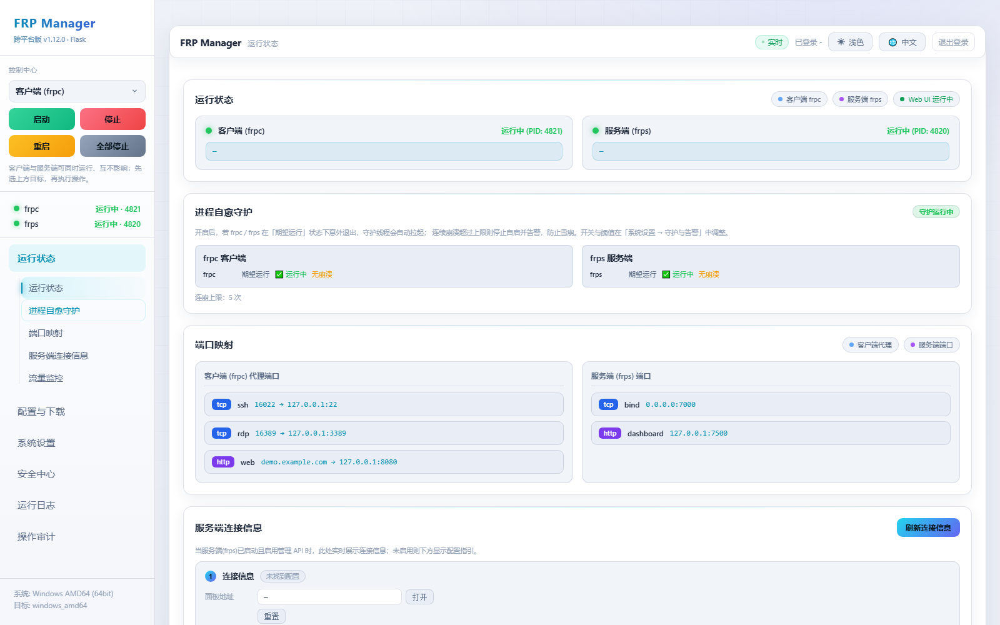
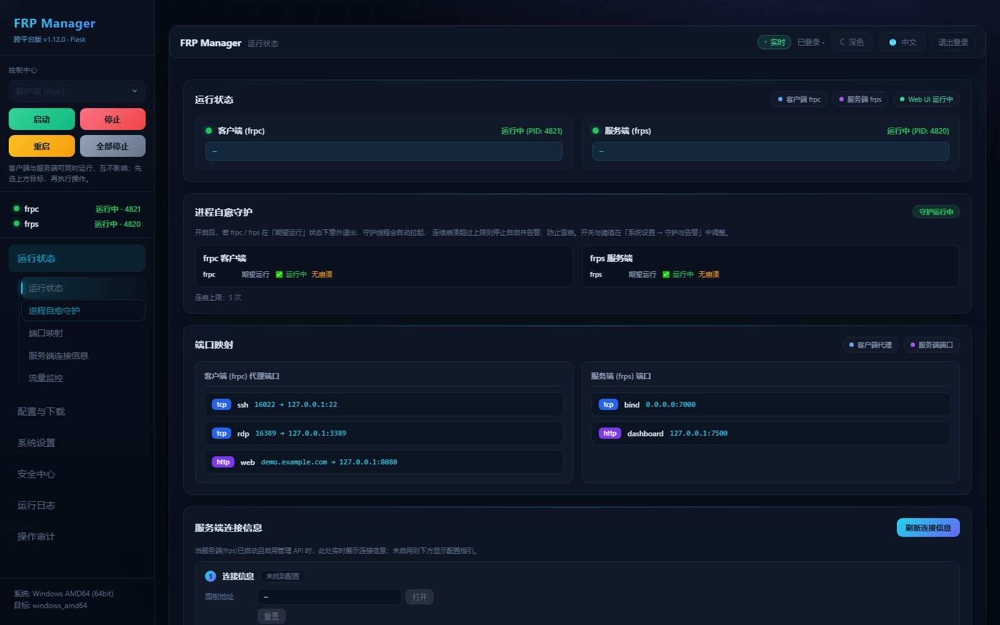
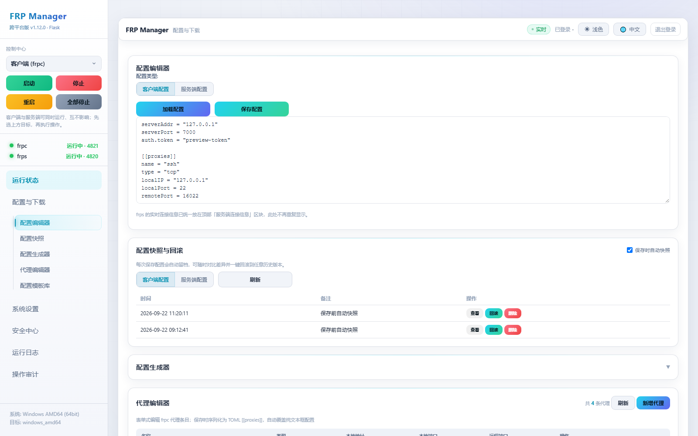
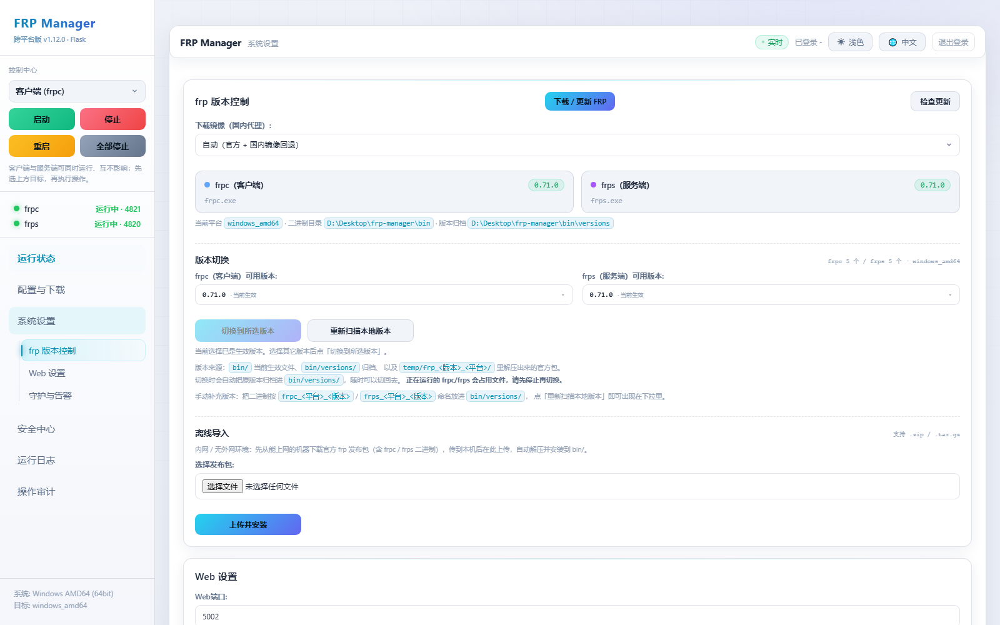
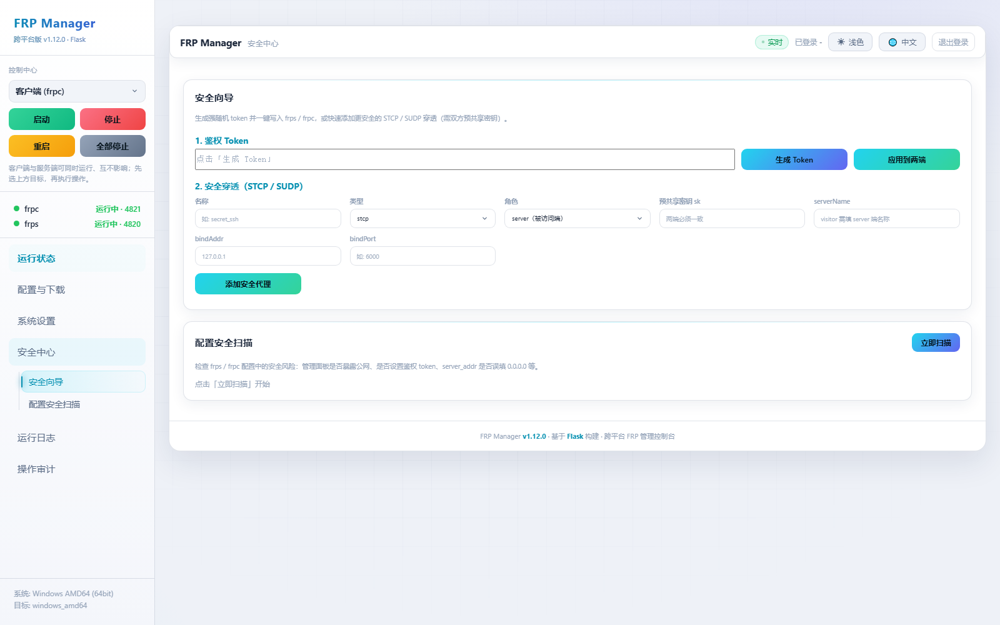
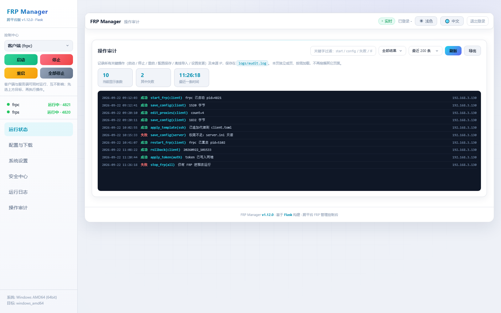

# FRP Manager - 跨平台FRP管理工具

一个简洁高效的跨平台FRP管理工具，提供Web界面进行配置和管理。

> **ARM 版 Ubuntu（aarch64 / armv7l）已适配**，详见下方 [ARM / Ubuntu 部署](#-arm--ubuntu-部署)。
> 一键安装：`./install_arm.sh --service`


## 🖼️ 界面预览

> 下图为面板真实渲染界面，截图使用演示数据（非真实配置，不含任何密钥）。

**运行状态 · 浅色主题**



**运行状态 · 深色主题**



| 配置与下载 | 系统设置 |
| :---: | :---: |
|  |  |
| **安全中心** | **操作审计** |
|  |  |

## ✨ 功能特性

- ✅ **Web界面管理** - 直观易用的网页配置界面
- ✅ **一键启动/停止** - 快速控制FRP服务
- ✅ **实时状态监控** - 查看运行状态和进程信息
- ✅ **日志查看** - 实时查看运行日志（含 frp 原始报错）
- ✅ **响应式设计** - 支持手机、平板、电脑自适应
- ✅ **跨平台支持** - Windows / Linux(x86_64) / **ARM Linux(ARM64/ARM32)** / macOS
- ✅ **架构自适应** - 自动识别 CPU 架构并下载对应的 frpc/frps
- ✅ **开机启动** - 各环境一键注册（Windows 注册表 / Linux systemd / macOS launchd），并设置「随程序启动 FRPC / FRPS」
- ✅ **下载进度可视化** - FRP 二进制下载带实时进度条，并支持 ghfast / gh-proxy 等**国内代理镜像**
- ✅ **进程自愈守护（Watchdog）** - frpc / frps 意外退出时自动拉起；连续崩溃超过上限则停止自启并告警，防止雪崩
- ✅ **配置安全扫描** - 一键检查 frps / frpc 配置（管理面板暴露、鉴权 token、server_addr 误填等）并给出修复建议
- ✅ **日志轮转与导出** - 按大小自动切割并保留历史，支持手动轮转与单文件下载
- ✅ **离线包导入** - 内网 / 无外网环境直接上传官方 frp 发布包（.zip / .tar.gz）安装到 bin/
- ✅ **操作审计日志** - 记录启动 / 停止 / 重启 / 配置保存 / 离线导入 / 设置变更及来源 IP
- ✅ **掉线告警推送** - frp 失联 / 自愈失败 / 启动失败时通过 Webhook（钉钉 / 飞书 / 企业微信）或邮件通知
- ✅ **配置快照与回滚** - 每次保存自动留档，可查看 / 对比 / 一键回滚历史版本
- ✅ **frp token / 加密向导** - 一键生成强随机 token 并写入 frps / frpc，快速添加 STCP / SUDP 安全穿透
- ✅ **表单式代理编辑器** - 按类型智能显示字段的增删改表单，保存时序列化为 `[[proxies]]`，列表带数量统计
- ✅ **操作审计独立页** - 独立成页（在「运行日志」下方），支持关键字过滤 / 成败筛选 / 统计卡片 / 一键导出
- ✅ **浅色·深色双主题** - 白色与黑色科技感两套配色一键切换，下拉框、表格、卡片、滚动条全局统一
- ✅ **按页懒加载** - 首屏只加载当前页数据，切页才按需请求，轮询在后台自动跳过

## 📝 版本历史

### v1.12.0（当前）
> 交互控件专项（版本选择器、分段切换、模板套用修复、下拉框统一）

- **版本切换下拉重做为「版本选择器」**：原生 `<select>` 放不下来源徽标 / 体积 / 待执行状态，改为按钮 + 弹出面板——每行显示版本号（等宽）、来源徽标（`生效中` / `bin` / `归档` / `解压包`）、体积、悬停看完整路径；选中打勾、`当前生效` / `待切换` 一目了然；支持 ↑↓ 键盘导航、Enter 选中、Esc 收起，超过 8 个版本自动出现筛选框。
- **「切换到所选版本」不再生硬**：只会为「选中且≠当前生效」的版本生成任务，frpc / frps 可各自指定；按钮在无待切换项时禁用，下方实时提示「当前选择已是生效版本」或「待切换：frpc → x.y.z（请先停止进程）」，切换前二次确认。
- **快照 / 配置类型的下拉改为分段切换器**：客户端 / 服务端只有两项，用下拉很别扭。改为分段按钮，底层仍保留真实 `<select>`，`.value` 与 `change` 事件语义不变，其余代码无需改动。
- **修复「配置模板库」套用按钮点了没反应**：根因是按钮为动态渲染但**完全没有事件委托**（对比快照列表有、模板列表漏了）。现已委托到列表；同时后端为每个模板返回占位符元信息（中文名 / 默认值 / 填写说明），改为**卡片内联表单**填写，去掉原先连弹 4 个 `window.prompt` 的交互；后端还会校验未填写的占位符并直接报错，避免把 `{LOCAL_IP}` 写进配置导致 frpc 起不来。
- **侧栏顺序调整**：`配置与下载` 移到 `系统设置` 之前（运行状态 → 配置与下载 → 系统设置 → 安全中心 → 运行日志 → 操作审计）。
- **统一全部下拉框**：基底样式原先只写在 `.form-group select` 内，工具条里的下拉没有边框 / 圆角 / 配色，显得忽大忽小。现已提到全局 `select`，并统一悬停、焦点环、禁用态、`option` 配色与选中高亮；修正 `.form-group` 覆盖导致箭头被文字压住的问题。

### v1.11.0
> 板块重组 + 性能专项（页面按职能拆分、自愈守护归位、状态接口提速）

- **页面按职能重新拆分**（原「配置与下载」一页塞了 9 个模块，全部同时渲染）：
  - 新增**「系统设置」**（位于「配置与下载」上方）：`frp 版本控制`（原「frp 二进制」改名，含下载/更新、版本切换、离线导入）+ `Web 设置`（端口 / 开机启动 / 登录认证）+ `守护与告警`（进程自愈、掉线推送，从 Web 设置中拆出独立区块）。
  - 新增**「安全中心」**：安全向导 + 配置安全扫描。
  - 「配置与下载」只保留配置相关：配置编辑器 / 配置快照 / 配置生成器 / 代理编辑器 / 配置模板库。
  - 侧栏二级目录随页面切换只展开当前页，锚点高亮与观察者同步更新。
- **修复「进程自愈守护」与相邻模块零间距**：该卡片原本不是标准 `.section`（只有 `margin-top`、没有 `margin-bottom`），导致与下方「端口映射」紧贴。已改为标准区块并纳入导航与锚点。
- **状态接口提速（打开网页慢的主因）**：`get_watchdog_status()` 在循环内调用 `get_frp_status()`，而每次都会全量遍历系统进程，单次 `/api/status` 触发 **6 次** 全进程扫描。改为单次扫描 + 1 秒 TTL 缓存，启停时主动作废缓存。实测单次 `/api/status` 从约 1s 降到 **5.75ms**。
- **侧栏版本号改为后端注入**：`{{ app_version }}` 直接取 `main.py` 的 `VERSION`，以后升版本不再需要改页面，也不会出现停留在 `v1.2` 的情况。

### v1.10.0
> 交互修复与 UI / 性能专项（代理编辑器、审计独立成页、双主题下拉框、按页懒加载）

- **修复「代理编辑器」完全不工作**：补齐从未绑定的事件（新增 / 保存 / 取消 / 行内编辑·删除按钮，行内按钮改事件委托），修正表格 6 列表头却只渲染 5 个单元格导致的整列错位，并让代理列表按类型显示 / 隐藏无关字段（TCP·UDP 显示远程端口、HTTP·HTTPS 显示域名、STCP·SUDP·XTCP 显示 sk / role / serverName）。新增「刷新」按钮与代理数量统计，保存前做同名与必填校验。
- **操作审计独立成页**：从「配置与下载」页移出，作为左侧导航一级页面放在「运行日志」下方。新增关键字过滤（防抖）、成败筛选、条数选择、统计卡片（当前条数 / 失败数 / 最近时间）与一键导出；审计内容改为结构化展示（时间 / 结果 / 动作 / 明细 / 来源 IP），失败条目红色标注，并支持关键字高亮。
- **下拉框与双主题 UI 统一**：修复 `select{appearance:none}` 去掉原生箭头却未补自定义箭头的问题，为所有下拉框补上与主题匹配的 SVG 箭头并统一内边距 / 悬停 / 焦点样式；统一输入框、滚动条、表格内小按钮与卡片配色，浅色（白）与深色（黑色科技感）两套主题下均校验一致；左侧「配置与下载」子项顺序改为与页面自上而下完全一致。
- **加载性能优化**：改为**按页懒加载**——首屏只请求当前页数据，仪表盘进页才拉流量 / 服务端信息，设置页进页才拉配置 / 版本 / 模板 / 代理 / 快照 / 开机启动 / 报警，审计页进页才拉审计日志；定时轮询在页面不可见或非当前页时跳过，切回前台立即补一次状态；日志轮询加可见性判断，操作审计默认 200 条。
- **侧栏版本号**由长期未更新的 `v1.2` 修正为与程序一致的版本。

### v1.9.0
> P3 配置闭环与安全增强（基于 `下一阶段规划.md` 的 P3 清单）

- **配置快照与回滚**：每次保存配置自动生成快照（`configs/snapshots/<类型>/<时间戳>.cfg` + `index.json`，保留最近 50 份），支持查看 / 对比 / 一键回滚 / 删除；「保存时自动快照」可在设置中开关。新增 `GET /api/snapshots/<类型>`、`GET/DELETE /api/snapshot/...`、`POST /api/snapshot/rollback`。
- **frp token / 加密向导**：一键生成密码学安全 token 并写入 frps 与 frpc 的 `[auth]` 段（兼容 TOML / INI），并提供 STCP / SUDP 预共享密钥代理快速添加。新增 `POST /api/security/token`、`POST /api/security/apply-token`、`POST /api/security/secure-proxy`。
- **内置 frp 升级至 v0.71.0**：默认下载版本由存在 CVE-2026-40910 的 0.67.0 升级到 0.71.0，安装脚本与文档同步更新。

### v1.8.0
> P2 体验与易用性增强（基于 `下一阶段规划.md` 的 P2 清单）

- **流量与资源监控**：`get_traffic_stats()` 通过 frps 管理 API 拉取各代理今日入/出流量与当前连接数，并用 psutil 取 frpc / frps 进程 CPU / 内存；frps 不可达时优雅降级。新增 `GET /api/traffic`，仪表盘「流量监控」卡片自动每 10s 刷新。
- **表单式代理编辑器**：`parse_proxies()` / `serialize_proxies()` 支持 TOML `[[proxies]]` 与旧式 INI 的双向解析，覆盖 name/type/localIP/localPort/remotePort/subdomain/customDomains/sk/role/serverName/locations/plugin 等字段。新增 `GET/POST /api/proxies`，前端提供增/删/改表单。
- **配置模板库**：`get_config_templates()` 内置 6 类常见场景模板，`apply_config_template()` 做占位符替换并写回 client 配置（ini 自动转 TOML）。新增 `GET /api/templates`、`POST /api/templates/apply`。
- **开机启动增强**：`app_settings.ini` 新增 `autostart_delay` / `autostart_mode`；Windows 走任务计划（延迟 + 系统级）、Linux systemd 增加 `After=network-online` 与延迟、macOS launchd 增加 `StartInterval` 与系统级。
- **中英文切换**：内置 `I18N` 字典（zh/en），主要文案经 `t(key)` 取词；语言偏好持久化到 `app_settings.ini`（`lang` 字段），默认中文、即时切换并重渲染。

### v1.7.0
> P1 稳定性与可观测性增强（基于 `下一阶段规划.md` 的 P1 清单）

- **进程自愈守护**：基于「期望运行状态」的 watchdog 线程，每 5 秒心跳检测，异常退出自动重启；连崩计数带退避与上限，超过上限停止自启并严重告警。
- **配置安全扫描**：正则解析 frps / frpc 的 ini / toml 配置，识别管理面板暴露公网、缺少 `auth.token`、面板监听 `0.0.0.0`、客户端 `server_addr=0.0.0.0` 等风险并给出修复建议。
- **日志轮转与导出**：原生 `os.replace` 链实现按大小切割、最多保留 N 份历史；新增手动轮转接口与单日志文件下载（带目录穿越防护）。
- **离线包导入**：上传官方发布包（.zip / .tar.gz），自动识别并安装 frpc / frps 二进制到 `bin/`，占用时给出明确提示。
- **操作审计日志**：独立 `logs/audit.log`（tab 分隔：时间 / 来源IP / 动作 / 对象 / 结果 / 明细），覆盖启动、停止、重启、保存配置、离线导入、设置变更。
- **掉线告警推送**：支持钉钉 / 飞书 / 企业微信 Webhook 与 SMTP 邮件；可分别开关「掉线 / 自愈失败 / 启动失败」三类告警，并提供测试发送。

## 🚀 快速开始

### 环境要求

- Python 3.7+
- Flask
- requests
- psutil

### 安装运行

```bash
# 克隆项目
git clone https://github.com/Code847/frp-manager.git
cd frp-manager

# 安装依赖
pip install -r requirements.txt

# 下载 frp 二进制（仓库不含 bin/，首次必须执行）
python download_frp.py

# 启动服务
python main.py

# 访问Web界面（端口被占用时会自动顺延，实际地址以控制台输出为准）
# http://localhost:5000
```

> **为什么仓库里没有 `bin/`？** frp 的 frpc / frps 可执行文件共约 143MB，
> 放在 Git 里会让仓库迅速膨胀。首次克隆后执行 `python download_frp.py` 即可按当前平台
> 自动下载（内置 ghfast / gh-proxy 等国内加速镜像，可用 `--mirror` 指定）；
> 也可以在面板的「系统设置 → frp 版本控制」里图形化下载与切换版本。

### Windows 快速启动

双击运行 `start.bat` 或在命令行执行：

```batch
start.bat
```

> `start.bat` 为**可见模式**：前台运行 `python -u main.py`，实时打印启动过程与面板地址，
> 出错时窗口保留并显示原因，方便排查（不会再出现「闪退、看不到提示」）。
> 面板启动后支持右下角托盘角标与菜单（见下节）。

### 🧭 Windows 托盘角标与菜单

| 角标颜色 | 含义 |
|------|------|
| 🟢 绿 | frps + frpc 都在运行 |
| 🟠 橙 | 只运行了其中一个 |
| 🔴 红 | frps / frpc 都没运行 |

图标底部左右两个小方块分别是 **FRPS（左）** / **FRPC（右）**，亮绿=运行中、灰=已停止；
鼠标悬停显示 `FRP Manager · FRPS 运行中 / FRPC 已停止`。

右键菜单：

```
FRPS 服务端: 运行中      ← 状态行（不可点）
FRPC 客户端: 已停止      ← 状态行（不可点）
──────────────
启动  ▶  启动 FRPS 服务端 / 启动 FRPC 客户端 / 全部启动
重启  ▶  重启 FRPS 服务端 / 重启 FRPC 客户端 / 全部重启
停止  ▶  停止 FRPS 服务端 / 停止 FRPC 客户端 / 全部停止
──────────────
打开Web界面 / 刷新状态 / 退出
```

- 状态每 **3 秒** 与实际进程同步一次（外部手动启动的 frpc/frps 也能识别）；
- 「启动」会先清掉同模式残留进程，避免旧 frp 占着端口导致新进程一启动就退出；
- 已在运行时点「启动」只会提示，不会把自己杀掉重启；
- 每个操作都会写一条 `[面板]` 事件日志，失败会弹气泡提示。

### Linux / ARM Ubuntu 快速启动

```bash
chmod +x install_arm.sh start_linux.sh build_arm.sh

# 一键安装（自动识别架构 + 下载对应 frp + 可选注册 systemd）
./install_arm.sh                 # 只装环境
sudo ./install_arm.sh --service  # 装完并设为开机自启（推荐）

# 或直接前台启动
./start_linux.sh
```

环境自检（确认架构与二进制是否匹配）：

```bash
python3 main.py --check
```

## 📁 项目结构

```
frp-manager/
├── main.py                # 主程序入口（跨平台 / 支持 systemd；已含系统托盘）
├── frp_manager.py         # FRP 管理核心（架构自适应 + 路径解析）
├── web_ui.py              # Web 界面服务（路由 + 业务接口）
├── web_auth.py            # Web 登录认证（账号密码 / 图形验证码 / 会话）
├── build_exe.py           # Windows 打包（PyInstaller）
├── requirements.txt       # Python 依赖（Python 3.8+）
├── requirements-py36.txt  # 旧版 Python 3.6 + ARM 专用依赖（脚本自动选用）
├── start.bat              # Windows 启动脚本
├── start_linux.sh         # Linux / ARM 启动脚本
├── install_arm.sh         # ARM Ubuntu 一键安装脚本
├── build_arm.sh           # Linux(含 ARM64) 打包脚本
├── build_windows.bat      # Windows 打包入口
├── README.md              # 项目说明（含安装 / ARM 部署 / systemd）
├── bin/                   # FRP 二进制（多架构共存，按 平台_架构 命名）
│   ├── frpc_windows_amd64.exe / frps_windows_amd64.exe
│   ├── frpc_linux_arm64       / frps_linux_arm64      # ARM64
│   └── frpc_linux_amd64       / frps_linux_amd64      # x86_64
│   └── versions/          # 历史版本归档（版本切换的备胎，自动生成）
├── configs/               # 配置目录（唯一权威：client.toml / server.toml）
│   ├── client.toml        # frpc 实际使用的配置
│   ├── server.toml(.ini)  # frps 实际使用的配置
│   ├── web_port.ini       # Web UI 端口
│   ├── web_auth.ini       # ★ Web 登录账号密码 + 图形验证码开关
│   └── .web_secret        # 会话签名密钥（自动生成，勿手动改）
├── web/                   # ★ 界面目录：改界面只动这里，不用碰 Python
│   ├── index.html         #   主控面板（CSS / JS 全部内联，单文件可整体替换）
│   └── login.html         #   登录页（CSS / JS 全部内联）
├── temp/                  # 运行时临时目录（下载解压 / 锁文件 / PID）
└── logs/                  # 日志目录（frp_client_*.log / frp_server_*.log）
```

### 运行时目录（打包版 / 开发版）

| 形态 | 资源目录（只读，static 等） | 数据目录（可写，configs/bin/logs） |
|------|------------------------------|--------------------------------------|
| 源码 `python main.py` | 项目目录 | 项目目录 |
| PyInstaller `--onedir` | `exe同目录/_internal` | exe 同目录 |
| PyInstaller `--onefile` | `sys._MEIPASS`（临时，退出即删） | exe 同目录；不可写时回退 `%APPDATA%/FRP-Manager` |

数据目录的确切路径可在 Web 端「frp 二进制」区块看到。

## 🔄 更新 frpc / frps

三种方式，任选其一，**都不会破坏已有配置**：

1. **界面更新（推荐）** —「配置与下载」页 →「FRP 下载 / 更新」→「下载 / 更新 FRP」，自动按当前 CPU 架构从官方源/镜像拉取并写入 `bin/`。
2. **手动替换** — 下载官方发布包，把里面的 `frpc` / `frps` 按 `frpc_<系统>_<架构>` / `frps_<系统>_<架构>`
   命名后放进 `bin/` 目录（架构后缀见 `main.py --check` 输出，如 `linux_arm64`、`windows_amd64`）；
   也可以直接用 `frpc` / `frps` 原名。程序**不会覆盖已存在的文件**，同名文件请自行先删再放。
3. **指定版本 / 镜像** — `POST /api/download-frp` 带 `version`、`mirror` 参数；界面里可先「检查更新」确认最新版本号，并在「下载镜像（国内代理）」下拉里选择优先使用的代理（ghfast / gh-proxy.com / ghproxy.net / mirror.ghproxy.com，或仅官方 GitHub）。

**下载进度**：点「下载 / 更新 FRP」后改为后台进行，页面下方实时显示进度条（解析版本 → 下载中 → 解压中 → 安装中 → 完成），
并通过 `GET /api/download-frp/progress` 轮询；无需傻等。下载镜像偏好会记到 `configs/app_settings.ini`，下次自动沿用。

替换后在「frp 二进制」区块可看到探测到的版本号（由 `<bin> -v` 得到），重新启动 FRP 即生效。

### 🔁 版本切换（回退 / 换版本）

「配置与下载」→「FRP 下载 / 更新」→「版本切换」，frpc / frps **各自一个下拉**，
列出本地所有可切换的版本，选好点「切换到所选版本」即可。

版本来源（自动扫描，点「重新扫描本地版本」可刷新）：

| 来源 | 说明 |
|------|------|
| `bin/` 当前生效文件 | 标记 ★，即 frpc/frps 正在用的那个 |
| `bin/versions/` | 归档目录，命名 `frpc_<平台>_<版本>`；**每次下载更新 / 切换前都会自动把旧版本归档进来** |
| `temp/frp_<版本>_<平台>/` | 官方发布包解压出来的目录（文件名本身不带版本号，靠目录名识别） |

- 只会列出**与当前平台一致**的版本（`arm` 不会误匹配 `arm64`）。
- 切换会先把当前版本归档，不会弄丢文件；若目标文件正被占用（frpc/frps 还在跑），会提示先停止。
- 手动补版本：把二进制按 `frpc_<平台>_<版本>` 命名丢进 `bin/versions/`，重新扫描即可。

## 🧭 界面结构

**左侧栏是常驻区**，从上到下：

```
FRP Manager
├─ 控制中心   ← 常驻：操作目标下拉 + 启动 / 停止 / 重启 / 全部停止
│               在任何页面都能直接启停 frpc / frps，不用先跳回首页
├─ 状态指示   ← frpc / frps 各一行，各自独立着色
├─ 目录树
│   ├─ 运行状态      ── 服务端连接信息 / 运行状态 / 端口映射
│   ├─ 配置与下载    ── 配置编辑器 / 配置生成器 / FRP 下载·更新 / Web 设置
│   └─ 运行日志
└─ 页脚       ← 系统信息
```

页面右上角是**顶部条**：当前页面名 + 实时指示 + 登录账号 + **主题切换（☀/☾）** + 退出登录，
滚动时吸附在顶部，随时可换深浅色。

目录树是**两级结构**：一级切换页面（切过去会自动回到页面顶部），缩进二级是页内段落，
**顺序与页面自上而下的顺序完全一致**，一级高亮「当前所在页」、二级高亮「当前滚到的段落」。

**状态配色**（侧栏每一行 + 首页状态卡片统一）：

| 颜色 | 状态 | 含义 |
|------|------|------|
| 🟢 绿色 + 发光 | 运行中 | 检测到进程且 PID 有效 |
| 🟠 橙色 | 未运行 | 本次会话里没启动过，属于待启动状态 |
| 🔴 红色 | 已停止 | 之前在运行，现在进程没了 |
| 🔴 红色 | 检测异常 | 进程探测失败 / API 取不到状态 |

右侧内容分三页，互不干扰：

| 页面 | 内容 |
|------|------|
| **运行状态**（首页） | **服务端连接信息 / 实时连接**（置顶）、运行状态、端口映射 |
| **配置与下载** | 配置编辑器、配置生成器、**FRP 下载 / 更新**（二进制版本 + 检查更新 + 一键下载 + 进度条 + 国内代理镜像 + **版本切换**）、Web 设置（端口 + 登录认证 + **开机启动**） |
| **运行日志** | 独立日志页，可按 frpc / frps / 面板过滤，每行带 `[frpc]`/`[frps]`/`[面板]` 前缀并按时间归并 |

**运行日志按来源着色**，一眼分清是谁打的：

| 颜色 | 来源 |
|------|------|
| 🔵 蓝色（`#38bdf8`） | `[frps]` 服务端 |
| 🟡 黄色（`#fbbf24`） | `[frpc]` 客户端 |
| 🟣 紫色（`#c084fc`） | `[面板]` 本程序自己的记录（启停操作、**HTTP 链接可达性检测**） |
| ⚪ 灰色 | 其它 / 未识别来源 |

`[面板]` 的内容来自 `logs/manager.log`（与 frp 的输出分开存放），记录：

- 启动 / 停止 / 重启 frps、frpc 的结果；
- 每 30 秒一次的 **HTTP 链接状态检测**（状态变化时才记，不刷屏）：
  本管理面板地址、frps 管理面板(API) 地址、frps 客户端接入端口、
  以及 frpc 配置里 `http`/`https` 类型穿透的域名。

```text
[面板] 2026-09-19 14:54:55 HTTP 链接可达 · 本管理面板 http://127.0.0.1:5000
[面板] 2026-09-19 14:54:57 HTTP 链接不可达 · frps 管理面板(API) http://127.0.0.1:7500
[面板] 2026-09-19 14:55:50 启动 FRPS 服务端 成功 · FRP 启动成功 (PID: 12452)
```

实时结果也可以用接口拿：`GET /api/links`。

整行左侧还有一条同色竖条，密集日志里也能快速扫。日志内容做了 HTML 转义，不会被日志里的文本注入。

## 🔐 Web 登录认证

打开面板会先进登录页（参考 tech-admin 的科技感风格：星点粒子背景 + 玻璃拟态卡片）。
**账号密码与图形验证码开关全部保存在配置文件** `configs/web_auth.ini`：

```ini
[auth]
enabled         = true      # 是否启用登录保护（false = 免登录直接进面板）
username        = admin
password        = admin     # 明文即可；也支持 werkzeug 的 pbkdf2 哈希串
captcha         = true      # ★ 图形验证码开关
session_minutes = 0         # 会话有效期(分钟)，0 = 关掉浏览器即失效
remember_days   = 7         # 勾选「记住此设备」后保留的天数
```

| 项 | 说明 |
|----|------|
| **默认账号** | `admin` / `admin`（登录页会提示尽快修改，但**不显示**账号名和口令本身） |
| **图形验证码** | `captcha = true` 时登录页多一个 4 位验证码输入框；图片由后端纯 Python 生成 SVG（无 Pillow 依赖），点击图片换一张，3 分钟失效 |
| **改密方式** | 「配置与下载 → Web 设置 → 登录认证」，或在机器上编辑 `configs/web_auth.ini` |
| **忘记密码** | 编辑 `configs/web_auth.ini` 的 `password` 一行即可，无需重启进程 |
| **彻底免登录** | 把 `enabled` 改成 `false`，或在「Web 设置」里取消勾选「访问面板前必须登录」 |
| **会话失效** | 改了密码/账号后，所有已登录会话立即失效；前端检测到 401 会自动跳回登录页 |

> 提示：会话用 Flask 签名 Cookie 保存，密钥落在 `configs/.web_secret`（首次运行自动生成，重启不丢）。
>
> **登录页不会暴露任何服务端信息** —— 不显示配置文件路径、账号名、默认口令，
> 需要时请以能登录机器/查看 README 的身份直接改配置文件。

## ⚙️ 配置说明

默认客户端配置文件 `configs/client.toml`：

```ini
[common]
server_addr = 你的FRP服务器地址
server_port = 7000
token = 你的认证令牌

[代理名称1]
type = tcp
local_ip = 127.0.0.1
local_port = 本地端口
remote_port = 远程端口

[代理名称2]
type = tcp
local_ip = 127.0.0.1
local_port = 本地端口
remote_port = 远程端口
```

## 📱 界面预览

### 桌面端
- 三列状态卡片
- 完整功能展示
- 宽松布局设计

### 移动端
- 单列自适应布局
- 紧凑元素设计
- 触屏优化交互

## 🔧 API 接口

| 接口 | 方法 | 说明 |
|------|------|------|
| `/api/status` | GET | 获取 frpc / frps 各自运行状态与端口映射 |
| `/api/info` | GET | 平台、架构、二进制路径与**版本号**、各数据目录 |
| `/api/frp/latest` | GET | 查询 frp 官方最新版本号（检查更新） |
| `/api/bin/versions` | GET | 扫描本地已有的 frpc / frps 版本（含来源、大小、是否生效中） |
| `/api/bin/switch` | POST | 切换版本，body `{mode: "client"\|"server", version: "0.67.0"}` |
| `/api/start` | POST | 启动FRP服务（`mode=client\|server`） |
| `/api/stop` | POST | 停止FRP服务 |
| `/api/config/<client\|server>` | GET/POST | 读写对应模式的唯一权威配置 |
| `/api/server/info` | GET | frps 管理API 的代理连接信息（后端代发） |
| `/api/server/api` | GET | frps 管理API 的连接方式（自动解析 `[webServer]`） |
| `/api/server/probe` | GET | 探测 frps 管理API 连通性（Basic Auth），支持 `?host=&port=` 覆盖；失败返回可读原因与排查建议 |
| `/api/server/fix-config` | POST | 把 ini 里不被识别的 `[webServer]` 段转成 `dashboard_*`（自动备份） |
| `/api/log` | GET | 运行日志，`mode=all\|client\|server\|webui`、`lines=N\|all`；每行带 `[frpc]`/`[frps]`/`[面板]` 前缀 |
| `/api/links` | GET | 当前 HTTP 链接状态（本面板 / frps 管理API / 接入端口 / http 穿透域名） |
| `/api/log/clear` | POST | 清空 `logs/` 下的 frp 运行日志 |
| `/api/download-frp` | POST | 后台下载/更新当前架构的 frp 二进制（可带 `version` / `mirror`），立即返回，进度见下条 |
| `/api/download-frp/progress` | GET | 查询后台下载进度（`phase` / `percent` / `done` / `total` / `ok` / `finished`） |
| `/api/settings/autostart` | GET/POST | 开机启动设置：读取当前设置与系统是否支持、是否已注册；保存时写 `configs/app_settings.ini` 并按需注册/注销开机启动（`app_on_boot` / `frpc_on_start` / `frps_on_start` / `mirror`） |
| `/login` | GET | 登录页（未启用认证时自动跳回首页） |
| `/logout` | GET | 退出登录并回到登录页 |
| `/api/captcha` | GET | 取一张图形验证码（SVG），答案存在会话里，3 分钟失效 |
| `/api/login` | POST | `user` / `pwd` / `code` / `remember` / `next`，成功返回跳转地址 |
| `/api/auth/config` | GET/POST | 读取 / 修改登录认证配置（账号、密码、验证码开关、会话时长） |

### 服务端（frps）管理 API 怎么连

在 **服务端配置** 里启用 `webServer`（ini 与 toml 写法都支持）：

```toml
# frps 服务端配置（server.toml）
bindPort = 7000
auth.token = "改成更复杂的"

[webServer]
addr = "0.0.0.0"
port = 7500
user = "admin"
password = "改成更复杂的"
```

保存并启动 frps 后，仪表盘底部的「服务端连接信息」会自动解析出地址、鉴权方式与常用端点。
该区块按 **① 连接信息 → ② Basic Auth 鉴权凭证 → ③ 接口与连通性检测** 三段组织：

| 段 | 作用 | 可否修改 |
|---|---|---|
| **① 连接信息** | 面板地址 / 后端探测 / 监听地址 / 鉴权方式 / 连接状态 | 面板地址可手动改并记住 |
| **② Basic Auth 鉴权凭证** | 用户名 + 密码，**直接写回服务端配置文件** | ✅ 可改 |
| **③ 接口与连通性检测** | 端点清单、可复制的 `curl` 示例、覆盖地址/端口、「检测 API 连接」、「一键修复配置」 | 检测参数可调 |

第 ② 段修改账号密码时：

- 按配置文件后缀自动选写法 —— `.ini` 写 `dashboard_user/dashboard_pwd`，
  `.toml` 写 `webServer.user/webServer.password`（已有 `[webServer]` 段则改段内）
- 保存前自动备份（`<配置>.bak-时间戳`）
- **必须重启 frps 才生效**，保存后页面会提示

```bash
# 外部程序调用示例（页面上第 ③ 段有「复制」按钮，凭据已填好）
curl -u admin:密码 http://127.0.0.1:7500/api/serverinfo
curl -u admin:密码 http://127.0.0.1:7500/api/proxy/tcp
```

> 「检测 API 连接」由 **FRP Manager 后端代发请求**，不经过浏览器 —— 因为 frps 的
> dashboard 不返回 CORS 头，浏览器 `fetch` 会被拦。

### 两个地址不是一回事

| 展示项 | 用途 | 取值 |
|---|---|---|
| **面板地址** | 浏览器点击 / 外部 `curl` | frps 机器的可达 IP（默认取你访问本管理端用的那个 Host），可在页面上手动改，会记住 |
| **后端探测 / API 基址** | FRP Manager 后端代发请求 | 本机 `127.0.0.1`（同机最快；frps 的 dashboard 不带 CORS 头，浏览器直连会被拦） |

所以你在 `192.168.1.10:5000` 打开管理端时，面板地址自动是 `http://192.168.1.10:7500`，
而后端探测仍是 `http://127.0.0.1:7500` —— 不一样是正常的。

### ⚠️ 最大的坑：ini 格式不认 `[webServer]` 段

实测 frp 0.67：**同一个 dashboard 配置，写法不同结果完全不同**。

| 配置文件后缀 | 写法 | 管理面板是否启动 |
|---|---|---|
| `.ini` | `[webServer]` 段（addr/port/user/password） | ❌ **被 frp 忽略，端口不监听** |
| `.ini` | `dashboard_addr/port/user/pwd`（写在 `[common]` 里） | ✅ |
| `.toml` | `[webServer]` 段 | ✅ |
| `.toml` | `webServer.addr` / `webServer.port`（点号） | ✅ |

典型症状：`frps` 明明在跑（7000 在监听），但「检测 API 连接」报
`Connection refused / Errno 111` —— 因为 7500 根本没开。

对应处理：

1. **新装**：服务端默认配置已改为 **TOML**（`configs/server.toml`），开箱即用。
2. **已经是 ini 且写了 `[webServer]`**：页面上会亮出黄色「**一键修复配置**」按钮，
   点一下自动把该段转成 `dashboard_*` 字段并备份原文件（`.bak-时间戳`），
   **然后到「控制中心」重启 frps** 即可。
3. 想手动改：按上面表格的第二行写，或直接把服务端配置改成 `.toml`。

另外，改完 `[webServer]` / `dashboard_*` **必须重启 frps** 才会生效。

## 📝 更新日志

### v1.6.0
- **开机启动（各环境）**：Web 设置新增「开机启动」区块，勾选后把本程序注册为开机自启——
  Windows 写注册表 `HKCU\…\Run`、Linux 写 systemd 用户服务（回退 `~/.config/autostart` 桌面项）、
  macOS 写 launchd。同时可单独勾选「随程序启动 FRPC / FRPS」，设置存 `configs/app_settings.ini`，
  程序每次启动按设置自动拉起对应的 frp
- **FRP 下载进度可视化**：「下载 / 更新 FRP」改为后台进行，页面实时进度条（解析版本 → 下载 → 解压 → 安装 → 完成），
  新增 `GET /api/download-frp/progress` 轮询
- **国内代理镜像**：下载镜像下拉可选 ghfast / gh-proxy.com / ghproxy.net / mirror.ghproxy.com / 仅官方，
  偏好保存到设置；`build_mirror_list()` 按所选镜像优先 + 官方回退
- 命令行参数同步：`start_frp(version, mirror)` 透传镜像

### v1.5.0
- **修复托盘角标与真实状态不符**：`get_frp_status()` 返回的是 `{'client':…, 'server':…}`，
  旧代码在外层取 `running` 恒为 `None`，导致角标永远红色、菜单永远显示「已停止」；
  现按模式分别判定，外部手动启动的 frpc/frps 也能识别
- **托盘菜单重做**：状态行分「FRPS 服务端 / FRPC 客户端」两行；操作按
  启动 / 重启 / 停止 三个子菜单分组，每个都含 FRPS、FRPC 与「全部启动 / 全部重启 / 全部停止」
- **修复「点启动跟已有 frp 冲突」**：启动前先清掉同模式残留进程（旧进程占端口会让新进程
  一启动就退出）；已在运行时点启动只提示、不重复拉起
- **角标三色**：绿=frps+frpc 全运行，橙=只跑一个，红=全停止；图标底部两个小方块
  分别指示 FRPS / FRPC；悬停提示 `FRPS 运行中 / FRPC 已停止`；状态 3 秒同步一次
- **`start.bat` 静默启动**：优先 `pythonw.exe`，无黑窗口、不打印状态（有角标了），
  只在找不到 Python 时提示；需要控制台就执行 `python main.py`
- **新增 `[面板]` 日志来源（紫色）**：本程序自己的记录写进 `logs/manager.log`，
  与 frp 的输出分开，日志页新增「面板 HTTP 链接」过滤项
- **HTTP 链接状态进日志**：每 30 秒检测本管理面板、frps 管理面板(API)、frps 接入端口、
  http/https 穿透域名，状态变化时才写日志；启停操作后立即检测一次并强制记录
- 新增接口 `GET /api/links`；`/api/log` 的 `mode` 支持 `webui`

### v1.4.0
- **管理 API 区块重构**：拆成「① 连接信息 → ② Basic Auth 鉴权凭证 → ③ 接口与连通性检测」三段，
  编号徽标 + 独立卡片，说明文字与配置指引收进折叠区
- **Basic Auth 账号密码可改**：第 ② 段直接编辑并写回服务端配置文件，按 ini / toml 自动选
  `dashboard_*` 或 `webServer.*` 写法，自动备份，密码默认掩码（点「显示」才明文）
- **一键复制调用命令**：第 ③ 段按当前地址与凭据生成 `curl` 示例，点「复制」即可
- **连接信息移回首页底部**：顺序恢复为 运行状态 → 端口映射 → 服务端连接信息，侧栏目录同步
- **模块整合**：`app_paths.py` 并入 `frp_manager.py`、`system_tray.py` 并入 `main.py`，
  Python 模块从 6 个减到 4 个
- **文档整合**：`INSTALL.md`、`README_ARM.md`、`deploy/frp-manager.service` 全部并入 `README.md`；
  删除 `build_linux.sh`（只是 `build_arm.sh` 的转发壳）
- **根目录 145KB `frps.log` 归位**：服务端配置改为写 `logs/frps.log`，根目录不再堆日志
- **修 bug**：`this.apiDashUrl` 从未绑定，导致「打开 / 重置 / 记住面板地址」三个功能全部静默失效，
  且面板地址输入框永远为空

### v1.3.0
- **界面单文件化**：首页与登录页搬进 `web/index.html` / `web/login.html`，CSS 与 JS 全部内联，
  改界面（或整套换皮肤）只替换 `web/` 里的 html 即可，Python 一行不用动
- **实时连接信息置顶**：「服务端连接信息 / 实时连接」移到首页第一个区块，侧栏目录顺序同步
- **主题切换移到右上角**：新增吸附顶部条（页面名 + 实时指示 + 账号 + 主题 + 退出），
  滚动到哪都能一键换深浅色
- **日志按来源着色**：`[frps]` 蓝、`[frpc]` 黄、其它灰，整行带同色竖条；内容做 HTML 转义
- **frpc / frps 版本切换**：扫描 `bin/`、`bin/versions/`、`temp/frp_<版本>_<平台>/`，
  下拉选版本一键切换，切换前后自动归档，支持回退
- **目录瘦身**：删掉已失效的 `static/style.css`、并入 html 的 `static/script.js` 与 96KB 的
  `web_ui.py.bak`；打包脚本改为携带 `web/`
- **修 bug**：`web_auth.py` 的 `/logout` 仍在使用已删除的 `LOGIN_TEMPLATE` 变量，会直接抛
  `NameError`（用 pyflakes 全量扫出来的）

### v1.2.0
- **侧栏状态三色**：frpc / frps 各一行独立着色 —— 运行中绿、未运行橙、已停止/检测异常红
- **左侧目录改两级树**：一级=页面，缩进二级=页内段落，顺序与页面自上而下一致；
  一级标当前页、二级标当前段落；切换页面自动回到顶部（原来是停在上一页的滚动位置）
- **页面三分布局**：运行状态（首页）/ 配置与下载 / 运行日志，各自独立
- **控制中心常驻左侧栏顶部**：操作目标下拉 + 启动 / 停止 / 重启 / 全部停止，切到任何页面都能直接操作
- **侧栏模块重整**：品牌 → 控制中心 → 状态指示 → 页面导航 → 页内锚点（跟随页面自动切换）→ 页脚
- **Web 登录认证**：新增登录页（参考 tech-admin 风格），账号密码保存在 `configs/web_auth.ini`
- **登录页不泄漏服务端信息**：不显示配置文件路径、账号名与默认口令，只提示「需管理员修改」
- **图形验证码**：新增 `captcha` 开关，后端纯 Python 生成 SVG 验证码，无 Pillow 依赖
- **会话管理**：签名 Cookie + 「记住此设备 N 天」，改密后旧会话立即失效，401 自动跳登录页

### v1.1.0
- 服务端连接信息自动关联 frps 配置里的 dashboard / API 信息
- 支持 ini / toml 双格式解析 `[webServer]`、`dashboard_*`、点号式 TOML
- 修 ini 下 `[webServer]` 段不生效的问题（一键修复配置）
- 分离「面板地址」与「后端探测地址」

### v1.0.0 (2026-03-05)
- 初始版本发布
- Web界面管理
- 一键启动/停止
- 响应式设计

## 📦 安装部署（Windows / Linux 通用）

### 系统要求

- **Windows**: Windows 7/8/10/11, Python 3.7+
- **Linux**: Ubuntu/Debian/CentOS, Python 3.7+
- **内存**: 至少 512MB RAM
- **磁盘**: 至少 100MB 可用空间

### 快速安装

#### Windows 用户

1. 下载本项目
2. 双击运行 `start_windows.bat`
3. 程序会自动：
   - 检查Python环境
   - 创建虚拟环境
   - 安装依赖包
   - 下载FRP二进制文件
   - 启动Web界面

#### Linux 用户

1. 下载本项目
2. 给启动脚本添加执行权限：
   ```bash
   chmod +x start_linux.sh
   ```
3. 运行启动脚本：
   ```bash
   ./start_linux.sh
   ```

### 手动安装

#### 1. 安装Python

**Windows:**
- 访问 [Python官网](https://www.python.org/downloads/)
- 下载Python 3.7+ 安装包
- 安装时勾选 "Add Python to PATH"

**Linux (Ubuntu/Debian):**
```bash
sudo apt update
sudo apt install python3 python3-venv python3-pip -y
```

**Linux (CentOS/RHEL):**
```bash
sudo yum install python3 python3-pip -y
```

#### 2. 下载项目

```bash
git clone https://github.com/Code847/frp-manager.git
cd frp-manager

```

#### 3. 安装依赖

```bash
python -m venv venv

venv\Scripts\activate

source venv/bin/activate

pip install -r requirements.txt
```

#### 4. 运行程序

```bash
python main.py
```

访问 http://localhost:8080 打开配置界面

### 防火墙配置

#### Windows 防火墙
1. 打开"Windows Defender 防火墙"
2. 点击"允许应用或功能通过防火墙"
3. 点击"允许其他应用"
4. 浏览到 `frp-manager\bin\frpc.exe` 和 `frp-manager\bin\frps.exe`
5. 勾选"专用"和"公用"网络

#### Linux 防火墙
```bash
sudo ufw allow 8080/tcp  # Web界面端口
sudo ufw allow 7000/tcp  # FRP默认端口

sudo firewall-cmd --permanent --add-port=8080/tcp
sudo firewall-cmd --permanent --add-port=7000/tcp
sudo firewall-cmd --reload
```

### 使用说明

#### 首次运行
1. 程序会自动下载FRP二进制文件
2. 访问 http://localhost:8080 打开Web界面
3. 在"快速配置"中填写服务器信息
4. 点击"生成配置"
5. 点击"保存配置"
6. 选择运行模式（客户端/服务端）
7. 点击"启动FRP"

#### 配置说明
- **客户端模式**: 用于将本地服务暴露到公网
- **服务端模式**: 用于搭建FRP服务器
- **配置文件**: 支持ini格式，语法与官方FRP一致

#### 常见问题

##### 1. 下载FRP失败
- 检查网络连接
- 手动下载FRP二进制文件：
  - Windows: 下载 `frpc_windows_amd64.exe` 和 `frps_windows_amd64.exe`
  - Linux: 下载 `frpc_linux_amd64` 和 `frps_linux_amd64`
  - 放到 `frp-manager/bin/` 目录下
  - Linux系统需要给二进制文件添加执行权限：`chmod +x bin/frpc bin/frps`

##### 2. Web界面无法访问
- 检查端口8080是否被占用
- 检查防火墙设置
- 尝试使用 `http://127.0.0.1:8080`

##### 3. FRP连接失败
- 检查服务器地址和端口是否正确
- 检查token是否一致
- 检查防火墙是否放行相应端口
- 查看日志文件获取详细错误信息

##### 4. 程序无法启动
- 检查Python版本是否为3.7+
- 检查依赖包是否安装成功
- 查看控制台输出的错误信息

### 目录结构


### 更新说明

要更新FRP Manager到最新版本：

1. 停止当前运行的FRP服务
2. 下载最新版本代码
3. 重新运行 `start_windows.bat` 或 `start_linux.sh`
4. 程序会自动更新FRP二进制文件

### 技术支持

如有问题，请：
1. 查看日志文件获取详细信息
2. 检查防火墙和网络设置
3. 参考官方FRP文档：https://gofrp.org/docs/

### 许可证

本项目基于 MIT 许可证开源。

---

## 🔩 ARM / Ubuntu 部署

本项目已适配 **ARM 架构的 Ubuntu**（含 ARM64 / aarch64 与 32 位 ARMv7），
在树莓派、鲲鹏、飞腾、RK3588、各类云厂商 ARM 实例上均可直接运行。

---

### 一、关键改动说明

原程序是围绕 Windows 写的，在 ARM Ubuntu 上会直接崩。本次改造内容：

| 问题 | 原实现 | 改造后 |
|------|--------|--------|
| FRP 二进制写死 | `frpc_linux_amd64` 固定名 | 按 `platform.machine()` 自动映射 `linux_arm64` / `linux_arm` / `linux_amd64` / `linux_386` |
| 只下载 Windows 包 | URL 硬编码 `frp_x_windows_amd64.zip` | 按当前平台拼包名，`tar.gz`/`zip` 自动解压、自动 `chmod +x` |
| Windows 专有调用 | `subprocess.CREATE_NO_WINDOW`（Linux 下 AttributeError） | 统一封装 `_creation_flags()`，非 Windows 返回 0 |
| 进程探测 | `tasklist \| findstr frpc` | 统一走 `psutil`，同时兼容外部启动的 frpc/frps |
| 停止进程 | Windows 用 `taskkill`，Linux 用 `pkill -f frpc.*` 且 `check=True` 会抛异常 | `psutil` 遍历 + terminate，跨平台且不会误杀 |
| 启动失败无反馈 | 只返回“启动失败” | 回传日志尾部，直接看到 frp 报错原因 |
| 单实例检查 | 依赖 `tasklist` | PID 文件 + `psutil` / `os.kill(pid,0)` |
| headless 阻塞 | 主循环 `input()` 读 stdin | `threading.Event` 等待，systemd 下可常驻 |
| 托盘 | Linux 也尝试加载 pystray（需 X11） | Linux 默认不加载；`pystray/Pillow` 改为仅 Windows 安装 |
| 依赖安装 | 无脑 `pip install`，Ubuntu 24.04 上会被 PEP 668 拦 | 自动识别 venv，非 venv 追加 `--break-system-packages`，并回退清华源 |
| Web 端口保存 | 保存到源码目录，打包后写不进去 | 统一写到 `<程序目录>/configs/web_port.ini` |

> 另外：FRP 官方从 0.52 起把 INI 标记为 deprecated（0.67 仍可用，会有 warning）。
> 本项目继续使用 INI，界面提示保持兼容；如需 TOML 可直接在配置编辑器里粘贴 TOML 内容。

---

### 二、一键安装（推荐）

把整个项目目录拷到 ARM Ubuntu 机器上（例如 `/opt/frp-manager`），然后：

```bash
cd /opt/frp-manager
chmod +x install_arm.sh start_linux.sh build_arm.sh

./install_arm.sh

sudo ./install_arm.sh --service --port 5000
```

安装脚本会自动：

1. 识别 CPU 架构（`aarch64` → `linux_arm64`，`armv7l` → `linux_arm`）；
2. 安装 `python3-venv` / `python3-pip`（缺失时）；
3. 创建 `venv/` 并安装依赖（默认走清华源，可用 `PIP_INDEX=` 覆盖）；
4. 从 GitHub（含 4 个加速镜像回退）下载对应架构的 `frpc` / `frps`，
   落到 `bin/frpc_linux_arm64` 与 `bin/frps_linux_arm64`，并 `chmod 755`；
5. 运行环境自检；
6. `--service` 时生成并启动 systemd 服务 `frp-manager`。

完成后浏览器访问：

```
http://<ARM 机器IP>:5000
```

---

### 三、手动安装（不跑脚本）

```bash
sudo apt update
sudo apt install -y python3 python3-venv python3-pip curl

cd /opt/frp-manager
python3 -m venv venv
source venv/bin/activate
pip install -r requirements.txt -i https://pypi.tuna.tsinghua.edu.cn/simple

mkdir -p bin logs temp
FRP_VER=0.67.0
curl -fL -o /tmp/frp.tar.gz \
  https://github.com/fatedier/frp/releases/download/v${FRP_VER}/frp_${FRP_VER}_linux_arm64.tar.gz
tar -xzf /tmp/frp.tar.gz -C /tmp
cp /tmp/frp_${FRP_VER}_linux_arm64/frpc bin/frpc_linux_arm64
cp /tmp/frp_${FRP_VER}_linux_arm64/frps bin/frps_linux_arm64
chmod 755 bin/frpc_linux_arm64 bin/frps_linux_arm64

python main.py --check

python main.py            # 前台
python main.py --port 8080
```

32 位 ARM 系统把 `linux_arm64` 换成 `linux_arm` 即可。

---

### 四、systemd 常驻（ARM 服务器推荐）

`install_arm.sh --service` 已自动完成，也可手动：

```bash
sudo nano /etc/systemd/system/frp-manager.service   # 粘贴下面「systemd 常驻」章节的模板，改 User / WorkingDirectory / ExecStart 路径
sudo systemctl daemon-reload
sudo systemctl enable --now frp-manager
sudo systemctl status frp-manager
```

常用命令：

```bash
sudo systemctl restart frp-manager     # 重启面板
sudo journalctl -u frp-manager -f      # 实时日志
tail -f logs/service.log               # 服务输出
tail -f logs/frp_client_*.log          # frpc 自身日志
```

---

### 五、命令行参数

```
python main.py [选项]

  --host ADDR         Web 监听地址（默认 0.0.0.0）
  --port N            Web 端口（默认读 configs/web_port.ini，否则 5000）
  --no-tray           不启动系统托盘（Linux 默认就是不开）
  --force             忽略单实例检测，强制启动
  --check             只做环境自检（架构 / 依赖 / 二进制）后退出
  --download-frp      下载当前架构对应的 frpc/frps 后退出
  --version           显示版本
```

环境变量：

| 变量 | 作用 |
|------|------|
| `FRP_WEB_PORT` | 覆盖 Web 端口 |
| `FRP_VERSION` | 指定要下载的 frp 版本（默认 0.71.0） |
| `FRP_DOWNLOAD_MIRROR` | 自定义下载源前缀，如 `https://ghfast.top/https://github.com/...` |
| `PIP_INDEX` | pip 源（安装脚本使用） |

---

### 六、防火墙与放行

```bash
sudo ufw allow 5000/tcp     # Web 面板
sudo ufw allow 7000/tcp     # FRP 服务端端口（若本机当 frps）

ss -tnp | grep frpc
```

> ARM 云服务器还需在**安全组**里放行 5000 端口，否则外网访问不到面板。

---

### 七、打包成单目录可执行文件（可选）

PyInstaller **不支持交叉编译**，必须在 ARM64 机器上执行：

```bash
cd /opt/frp-manager
./build_arm.sh
./dist/FRP-Manager/start.sh
./dist/FRP-Manager/FRP-Manager --check
```

打包脚本会自动校验 `bin/` 里二进制的架构并打印 `file` 结果。
目标机器的 glibc 不能低于构建机。

---

### 八、常见问题

**1. 启动报 `FRP 二进制文件不存在`**
`bin/` 里缺当前架构的二进制。执行 `./install_arm.sh`，或手动按第三节放入
`frpc_linux_arm64` / `frps_linux_arm64`，并确认 `chmod 755`。

**2. 报 `Exec format error`**
放错了架构的二进制（例如把 amd64 的拷到 ARM）。用 `file bin/frpc_linux_arm64`
确认输出里有 `ARM aarch64`。

**3. pip 报 `externally-managed-environment`**
用虚拟环境：`python3 -m venv venv && source venv/bin/activate`，
或让脚本自动加 `--break-system-packages`。

**4. 面板打开了但 frpc 起不来**
在“运行日志”看 frp 原始报错；常见是 `server_addr` / `token` 没填，
或服务端不可达。日志文件在 `logs/frp_client_*.log`。

**5. 停止按钮没反应**
程序改用 `psutil` 枚举并终止 `frpc/frps`。若系统没装 psutil
（`pip install psutil`），会退回 `pkill`。

**6. 想让面板跟着开机自启 / 启动后自动拉起 frp**
- **Windows / 桌面 Linux / macOS**：在「配置与下载 → Web 设置 → 开机启动」里勾选
  「开机自动启动本程序」，程序会写入对应系统的开机自启项；再勾「随程序启动 FRPC / FRPS」，
  以后每次启动面板会自动拉起所选的 frp。设置存 `configs/app_settings.ini`。
- **无图形界面的 ARM 服务器**：用 `sudo ./install_arm.sh --service`（systemd 常驻），
  或在 `frp-manager.service` 的 `[Install]` 里管理自启，详见第四节 / systemd 章节。

**7. pip 报 `No matching distribution found for MarkupSafe<2.1,>=2.0` / `ModuleNotFoundError: No module named 'markupsafe'`**
这是 **ARM aarch64 + Python 3.6**（典型 Ubuntu 18.04）的「无解区间」，**不是版本下限写错**：

- 在 aarch64 上，MarkupSafe 2.0.x **根本没有预编译 wheel**，pip 被迫从源码编译；
- 而 MarkupSafe 2.0.x 的 `setup.py` 在构建阶段会自引用 `import markupsafe` 取版本号，
  此时模块还没装好 → 直接死锁报 `ModuleNotFoundError`；
- 2.1.0+ 又要求 Python ≥ 3.7，所以这个组合下**没有任何能装的 MarkupSafe 版本**。

**两种解法（任选其一）：**

**方案 A（推荐，最干净）：把系统 Python 升到 3.8+**
Ubuntu 18.04 默认是 3.6，用 deadsnakes 装 3.10（aarch64 wheel 齐全，全程无需编译）：

```bash
sudo apt update
sudo apt install -y software-properties-common
sudo add-apt-repository -y ppa:deadsnakes/ppa
sudo apt update
sudo apt install -y python3.10 python3.10-venv python3.10-dev
python3.10 -m venv venv && source venv/bin/activate
./install_arm.sh
```

**方案 B（留在 Python 3.6）：用 `requirements-py36.txt`（Flask 1.1.x 全纯 Python 链路）**
该清单把 Flask 降到 1.1.4 这一代——除 MarkupSafe/psutil 外**全部是 py2.py3-none-any 通用
wheel，aarch64 也能直装**；仅 MarkupSafe 1.1.1 需用 gcc 本地编译（其 setup.py 读文件取版本号，
可在 py3.6 正常编译）。`install_arm.sh` 检测到 py3.6 会**自动改用此清单并先装好 gcc/python3-dev**：

```bash
./install_arm.sh

sudo apt install -y gcc python3-dev python3-venv
python3 -m venv venv && source venv/bin/activate
pip install -r requirements-py36.txt
```

> 程序运行逻辑对 **Flask 1.1 与 3.x 均兼容**（仅用到 jsonify / render_template_string /
> request.is_json / send_from_directory / app.run 等通用 API），两种方案都**无需改代码**。
> 仍想用 Flask 3.x 新特性，选方案 A 升级 Python 即可。

---

## 🧩 systemd 常驻（Linux 服务器）

把下面内容存成 `/etc/systemd/system/frp-manager.service`，按实际用户与路径改 `User` / `WorkingDirectory` / `ExecStart`：

```ini
[Unit]
Description=FRP Manager - Web 管理面板
Documentation=https://github.com/fatedier/frp
After=network-online.target
Wants=network-online.target

[Service]
Type=simple
# 修改为实际运行用户与路径
User=ubuntu
WorkingDirectory=/opt/frp-manager
ExecStart=/opt/frp-manager/venv/bin/python /opt/frp-manager/main.py --no-tray
Restart=on-failure
RestartSec=5

# 优雅退出：先 SIGTERM，让主程序停掉 frpc 再退出
KillSignal=SIGTERM
TimeoutStopSec=15

StandardOutput=append:/opt/frp-manager/logs/service.log
StandardError=append:/opt/frp-manager/logs/service.log

NoNewPrivileges=true

[Install]
WantedBy=multi-user.target
```

```bash
sudo systemctl daemon-reload
sudo systemctl enable --now frp-manager
sudo systemctl status frp-manager
journalctl -u frp-manager -f
```

## 🤝 贡献指南

欢迎提交 Issue 和 Pull Request！

## 📄 许可证

MIT License - 欢迎使用和修改

## 🙏 感谢

- [FRP](https://github.com/fatedier/frp) - 优秀的内网穿透工具
- [Flask](https://flask.palletsprojects.com/) - 轻量级Web框架
