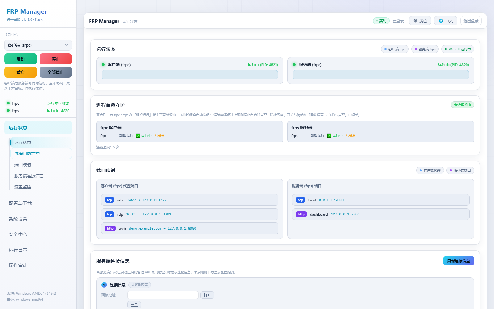
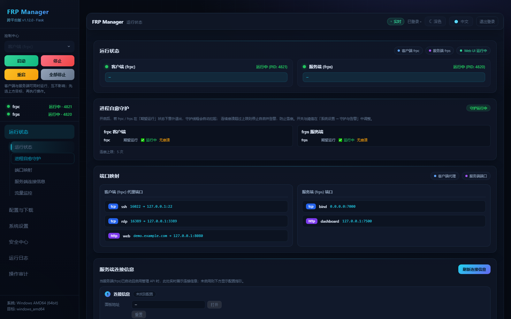
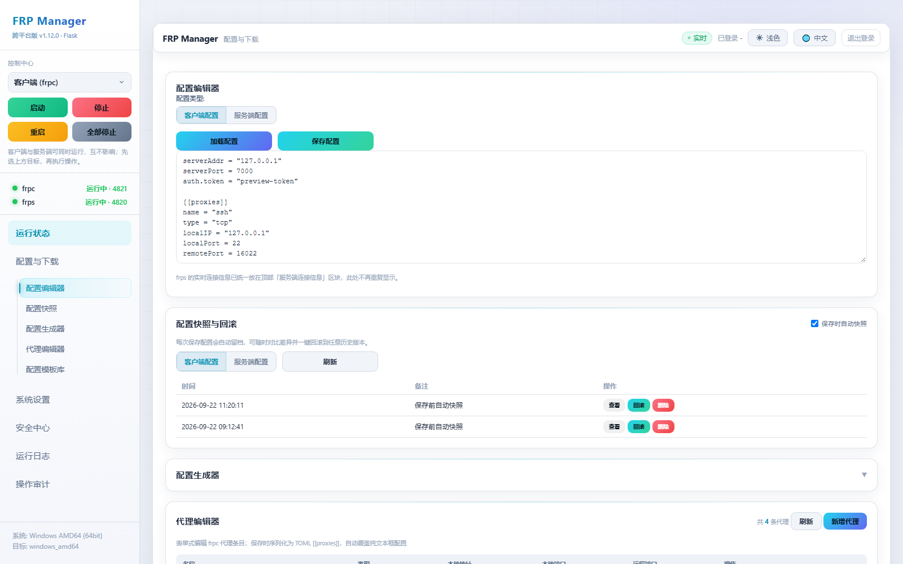
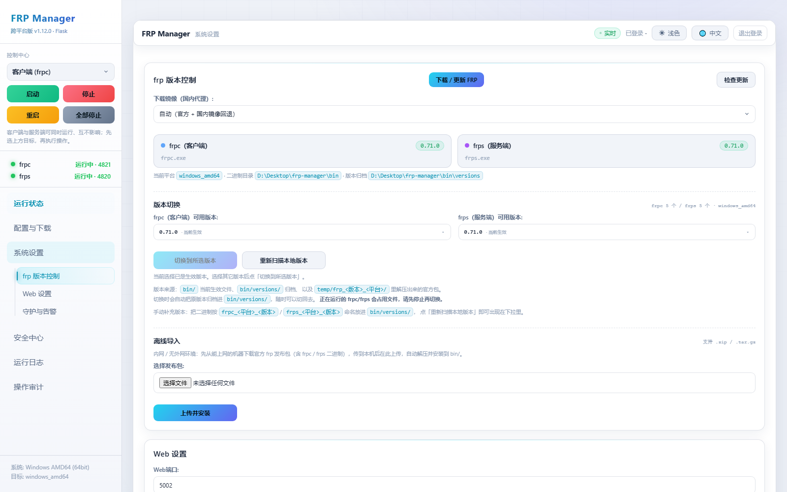
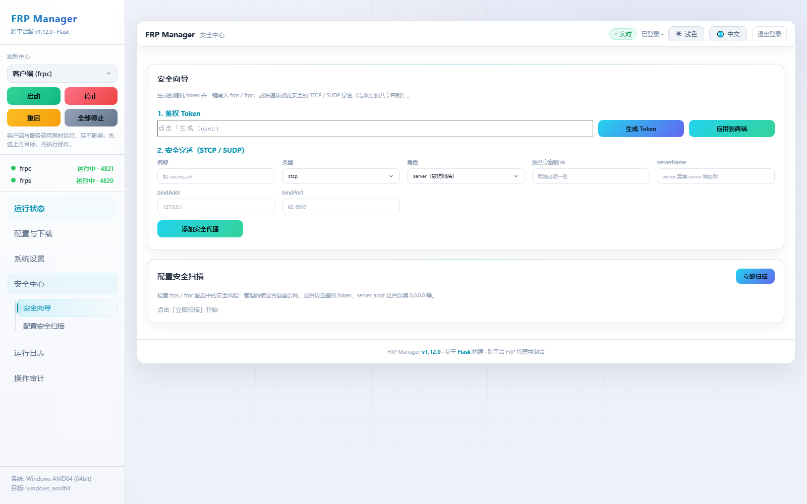
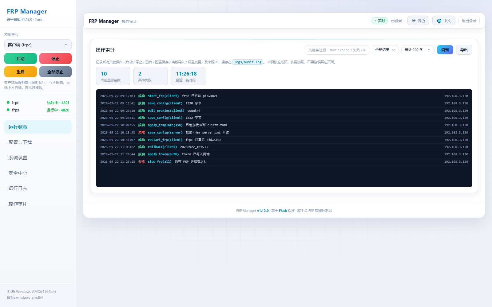

# FRP Manager - Cross-Platform FRP Management Tool

<div align="right">

[简体中文](README.md) | **English**

</div>

A clean and efficient cross-platform FRP management tool with a Web UI for configuration and control.

> **ARM Ubuntu (aarch64 / armv7l) is supported** — see [ARM / Ubuntu Deployment](#arm--ubuntu-deployment).
> One-line install: `./install_arm.sh --service`


## 🖼️ Screenshots

> Real rendered UI, captured with demo data (no real configs or secrets).

**Dashboard · Light theme**



**Dashboard · Dark theme**



| Config & Download | System Settings |
| :---: | :---: |
|  |  |
| **Security Center** | **Audit Log** |
|  |  |

## ✨ Features

- ✅ **Web UI management** - intuitive browser-based configuration
- ✅ **One-click start/stop** - quick control of FRP services
- ✅ **Real-time status monitoring** - process info and live status
- ✅ **Log viewer** - live logs including raw frp errors
- ✅ **Responsive design** - works on phone, tablet and desktop
- ✅ **Cross-platform** - Windows / Linux(x86_64) / **ARM Linux(ARM64/ARM32)** / macOS
- ✅ **Architecture auto-detection** - downloads the right frpc/frps for your CPU
- ✅ **Boot autostart** - one-click registration per OS (Windows registry / systemd / launchd), plus "start FRPC / FRPS with app"
- ✅ **Download progress** - live progress bar for binary downloads, with China mirror support (ghfast / gh-proxy etc.)
- ✅ **Watchdog self-healing** - auto-restarts crashed frpc / frps; stops and alerts after repeated crashes to avoid avalanche
- ✅ **Scheduled restart** - automatically restart frpc / frps every N hours or at a daily time (new in v1.13.0)
- ✅ **Config security scan** - detects exposed dashboards, missing auth token, wrong server_addr, with fix suggestions
- ✅ **Log rotation & export** - size-based rotation with history, manual rotate and per-file download
- ✅ **Offline package import** - install official frp archives (.zip / .tar.gz) without internet
- ✅ **Audit log** - records start / stop / restart / config save / import / settings changes with source IP
- ✅ **Downtime alerts** - Webhook (DingTalk / Feishu / WeCom) or email on failure events
- ✅ **Config snapshots & rollback** - auto snapshot on every save, diff and one-click rollback
- ✅ **Token / encryption wizard** - generate strong tokens, quick-add STCP / SUDP secure tunnels
- ✅ **Form-based proxy editor** - type-aware fields, serialized to `[[proxies]]`
- ✅ **Standalone audit page** - filter / stats / export
- ✅ **Light & dark themes** - consistent styling across controls
- ✅ **Per-page lazy loading** - only the current page fetches data; polling skipped when hidden
- ✅ **Bilingual UI** - built-in Chinese / English switch (🌐 in the top bar)
- ✅ **Login hardening** - failed-login rate limiting, IP allowlist (CIDR, one-click LAN address add), TOTP 2FA you can toggle any time (RFC6238, pure Python)
- ✅ **Per-platform binary downloads** - 9 OS/arch targets, SHA256 verification, resume support, "download only, don't install"
- ✅ **PWA** - add to Home Screen / desktop icon; shell works offline, live data always from network
- ✅ **Keyboard shortcuts** - `?` help, `/` focus filter, `Esc` close, `Ctrl+S` save, `Ctrl+D` refresh
- ✅ **Accessibility** - skip link, `focus-visible` rings, aria / role semantics
- ✅ **Single-file exe distribution** - `python build_exe.py` produces a standalone exe (no Python needed on the target machine); `build_installer.bat` wraps it into an installer with optional autostart and desktop shortcut

## 🚀 Quick Start

### Requirements

- Python 3.7+
- Flask, requests, psutil (`pip install -r requirements.txt`)

### Install & Run

```bash
git clone https://github.com/Code847/frp-manager.git
cd frp-manager

pip install -r requirements.txt

# Download frp binaries (bin/ is NOT in the repo, required on first run)
python download_frp.py

python main.py

# Open the Web UI (port auto-increments if taken; check console output)
# http://localhost:5000
```

> **Why is `bin/` not in the repo?** The frpc / frps binaries are ~143MB combined.
> Run `python download_frp.py` after cloning (China mirrors built in), or download/switch
> versions graphically in "System Settings → frp Version".

### Windows

Double-click `start.bat` (visible console mode; errors stay on screen).
The panel also provides a **system tray icon**:

| Icon color | Meaning |
|------|------|
| 🟢 Green | frps + frpc both running |
| 🟠 Orange | only one running |
| 🔴 Red | both stopped |

Right-click menu groups Start / Restart / Stop for FRPS, FRPC and All, plus
Open Web UI / Refresh / Exit. Status syncs every 3 seconds.

### Linux / ARM Ubuntu

```bash
chmod +x install_arm.sh start_linux.sh build_arm.sh

./install_arm.sh                 # environment only
sudo ./install_arm.sh --service  # install + systemd autostart (recommended)

./start_linux.sh                 # or run in foreground
python3 main.py --check          # environment self-check
```

## 🔐 Web Login

The panel is protected by an optional login page (tech-style glassmorphism with particle background).
Credentials live in `configs/web_auth.ini`:

```ini
[auth]
enabled         = true      # login protection on/off
username        = admin
password        = admin     # plain text or werkzeug pbkdf2 hash
captcha         = true      # SVG captcha (pure Python, no Pillow)
session_minutes = 0         # 0 = expire when browser closes
remember_days   = 7         # "remember this device" days
```

Default account `admin` / `admin` — change it in "Web Settings → Login" or by editing the ini.

### 🛡️ Login Hardening (v1.15.0)

> ⚠️ These keys live in the **`[auth]`** section together with the credentials —
> there is no separate `[security]` section. Older docs said otherwise; reading
> `[security]` is still tolerated, but the UI always writes `[auth]`.

**All off by default, applied immediately, no restart needed**:

```ini
[auth]
login_rate_limit = false   # master switch for failed-login limiting
max_fails         = 5      # failures inside the window
fail_window_min   = 15     # statistics window (minutes)
lock_min          = 30     # lock duration after triggering (minutes)
ip_allowlist      =        # comma-separated IPs, CIDR supported
totp_enabled      = false  # TOTP 2FA master switch
totp_secret       =        # generated by the UI, do not hand-edit
```

UI: **Security Center → Login Hardening** (same page as the account settings).

| Option | Description |
|------|-------------|
| **Failed-login limiting** | Counts failures per IP; after `max_fails` inside the window, that IP is rejected for `lock_min` minutes. Counters live in memory and reset on restart. |
| **IP allowlist (CIDR)** | Accepts `192.168.1.0/24`, `10.0.0.0/8` and friends. Allowlisted IPs **bypass everything, even the failure counter**.
  * The UI lists this machine's own addresses, each with **"Add to allowlist"** and **"Add whole subnet (/24)"** buttons — you never have to guess what to type.
  * It also shows your current source IP, and warns in advance ("saving will lock you out") if the list doesn't contain it.
  * When blocked, you get a `/blocked` page with the exact steps to recover — not a bare 403. |
| **TOTP 2FA** | RFC6238 implemented in pure Python (no third-party package). "Set up TOTP" shows a secret plus an `otpauth://` URI for Authenticator / 1Password; once enabled, a 6-digit code is required at login. |

  You can turn it **off and back on at any time**: disabling keeps the secret, so re-enabling only asks for the 6-digit code currently shown in your authenticator (no re-scan). After 8 wrong codes the endpoint rate-limits for 15 minutes, so the 6-digit space can't be brute-forced.

> Back up the TOTP secret after enabling — losing it means disabling 2FA and re-binding.

## ⚙️ Configuration

Client config lives at `configs/client.toml` (server: `configs/server.toml`):

```ini
[common]
server_addr = your-frp-server
server_port = 7000
token = your-auth-token

[proxy1]
type = tcp
local_ip = 127.0.0.1
local_port = 80
remote_port = 6080
```

## 🔄 Updating frpc / frps

Three ways — none of them touch your existing config:

1. **In the UI (recommended)** — "Config & Download → FRP Download / Update", with live progress and China mirrors.
2. **Manual replace** — drop binaries into `bin/` named `frpc_<os>_<arch>` / `frps_<os>_<arch>` (or plain `frpc`/`frps`). Existing files are never overwritten.
3. **Version switching** — "frp Version" panel scans `bin/`, `bin/versions/` and unpacked archives; old versions are archived automatically before switching.

**Three capabilities added in v1.15.0:**

| Capability | Notes |
|------------|-------|
| SHA256 verification | Fetches the official `checksums.txt`; a mismatch discards the package and marks the download failed. If no checksum is available the step is **skipped**, not failed — friendly for offline / self-hosted release pages. |
| Resume support | Downloads continue from `.part` via HTTP `Range`; if the server ignores Range and returns 200 the partial file is discarded and restarted; on failure the `.part` is kept for the next attempt. |
| Per-platform downloads | Pick a target other than the running one (e.g. a Linux ARM64 build for an SBC). The archive lands in `packages/` for you to copy — **your local `bin/` is untouched**. The progress bar shows `checksum / verified` and the final SHA256. |

Nine targets are available: Windows (x86_64 / ARM64 / 32-bit), Linux (x86_64 / ARM64 / ARMv7 / 32-bit) and macOS (x86_64 / Apple Silicon).
`linux_arm64`, `linux-arm64` and `linux/arm64` are all accepted.

## 📱 Install as an App (PWA, v1.15.0)

The panel ships a web app manifest, a service worker and an icon, so Chrome / Edge can offer
**"Install" or "Add to Home Screen"** — it then runs in its own window, independent of the browser tab.

- Service worker caches the shell only; `/api/*` and `/login` are **never** cached, so status is always live.
- Registration only happens on https or localhost. Over plain http on your LAN the browser would refuse it, so the panel silently degrades instead of throwing errors.
- `/sw.js`, `/manifest.webmanifest` and `/icon.svg` are served **without** the login guard — otherwise an unauthenticated browser could never fetch the manifest.

## 🔼 Panel Self-Update (v1.14.0)

The web panel can upgrade **itself** ("Panel Update" in the sidebar) — `main.py`, `web/index.html`, `frp_manager.py`, `web_ui.py`, etc.

- **Two update sources** — by default the official GitHub Releases (anonymous download, no token needed); or set a custom manifest URL in settings (JSON: `{version, notes, url, sha256?}`) for intranet / private distribution or local verification.
- **Safe overlay** — the package is SHA256-verified (when the manifest provides one), then only code files are overlaid. Protected directories — `configs / logs / temp / bin / .git / .workbuddy / venv` — are **never** touched, so updating never loses your config or deletes downloaded binaries. Extraction uses `zipfile.extractall(filter='data')` (Python 3.12+) to block zip path traversal.
- **Auto-backup & rollback** — before every overlay the current version is backed up to `temp/backup/<timestamp>/`; if something goes wrong (or you just want to revert), click "Rollback" on the Panel Update page to restore the pre-update version.
- **In-place restart** — after apply / rollback the process is relaunched in place (`os.execv` / `Popen`, Windows uses `pythonw` with no console window); the whole flow runs in a background thread so Web requests never block.

## 🕐 Scheduled Restart (v1.13.0)

"System Settings → Guard & Alerts → Scheduled Restart" automatically restarts frpc / frps:

- **Interval mode** - every N hours (1–720)
- **Daily mode** - at a fixed time each day (HH:MM)
- frpc and frps can be toggled independently
- Only restarts processes that are **running or registered with the watchdog** — it never starts frp on its own
- Failures are written to the `[Panel]` event log and trigger alert pushes
- Stored in `configs/app_settings.ini` under `[restart]`; API: `GET/POST /api/settings/autorestart`

## 🔧 API Overview

| Endpoint | Method | Description |
|------|------|------|
| `/api/status` | GET | frpc / frps running status & port mapping |
| `/api/info` | GET | platform, arch, binary paths & versions, data dirs |
| `/api/start` `/api/stop` `/api/restart` | POST | control FRP (`mode=client\|server`) |
| `/api/config/<client\|server>` | GET/POST | read/write the authoritative config |
| `/api/log` | GET | merged logs (`mode=all\|client\|server\|webui`) |
| `/api/links` | GET | HTTP link reachability (panel / frps API / tunnels) |
| `/api/download-frp` | POST | background binary download (optional `version` / `mirror` / `target` / `verify`) |
| `/api/auth/security` | GET/POST | read / write login-hardening settings (rate limit, CIDR allowlist, TOTP flag) — public |
| `/api/auth/totp/setup` | POST | **public**. Generate a TOTP secret; returns `secret` and the `otpauth://` URI |
| `/api/auth/totp/enable` | POST | **public**. Verify a 6-digit code, then really enable TOTP (`{code}`) |
| `/api/auth/totp/disable` | POST | **public**. Turn TOTP off |
| `/manifest.webmanifest` `/sw.js` `/icon.svg` | GET | PWA assets — served without login |
| `/api/download-frp/progress` | GET | download progress polling |
| `/api/bin/versions` `/api/bin/switch` | GET/POST | list / switch local frp versions |
| `/api/settings/autostart` | GET/POST | boot autostart settings |
| `/api/settings/monitor` | GET/POST | watchdog settings |
| `/api/settings/autorestart` | GET/POST | scheduled restart settings (v1.13.0) |
| `/api/settings/alert` | GET/POST | downtime alert settings |
| `/api/snapshots/<type>` etc. | GET/POST/DELETE | config snapshots & rollback |
| `/api/security/token` etc. | POST | token wizard / secure proxy |
| `/login` `/logout` `/api/login` `/api/captcha` | GET/POST | authentication |
| `/api/update/check` | GET | check for panel update (version / notes / url) |
| `/api/update/source` | GET/POST | read / set update source (empty = official GitHub) |
| `/api/update/apply` | POST | apply update in background (download → backup → overlay → restart) |
| `/api/update/rollback` | POST | rollback to latest backup in background |

### frps Admin API

Enable `webServer` in `configs/server.toml`:

```toml
[webServer]
addr = "0.0.0.0"
port = 7500
user = "admin"
password = "change-me"
```

> Known pitfall: in legacy `.ini` server config, a `[webServer]` section is **silently ignored**
> by frp — use `dashboard_*` keys in `[common]` instead (the UI offers a one-click fix).

## 📁 Project Layout

```
frp-manager/
├── main.py                # entry point (cross-platform, tray included)
├── frp_manager.py         # FRP core (arch detection, watchdog, scheduled restart)
├── web_ui.py              # Flask routes & business APIs
├── web_auth.py            # login auth (password / SVG captcha / sessions)
├── download_frp.py        # standalone frp downloader
├── build_exe.py           # PyInstaller packaging (onefile exe; --onedir for debugging)
├── installer.iss          # Inno Setup 6 script for the Windows installer
├── build_installer.bat    # one-click installer build (version read from the exe)
├── dist/                  # build output (gitignored)
├── web/                   # UI: single-file index.html + login.html (all inline)
│   ├── manifest.webmanifest # PWA manifest
│   ├── sw.js                # service worker (static only; API and /login never cached)
│   └── icon.svg             # PWA icon (512x512)
├── bin/                   # frp binaries (not in repo) + versions/ archive
├── packages/              # per-platform archives pulled for other devices
├── configs/               # runtime configs (client.toml / server.toml / app_settings.ini / web_auth.ini)
├── logs/                  # frp / manager / audit logs
└── temp/                  # runtime temp (downloads, lock, pid)
```

## ⌨️ Keyboard Shortcuts (v1.15.0)

| Key | Action |
|-----|--------|
| `?` | Shortcut help dialog |
| `/` | Jump to the filter box on the current page |
| `Esc` | Close the topmost dialog / form |
| `Ctrl+S` | Save the section you are looking at |
| `Ctrl+D` | Refresh the current page |

Shortcuts are ignored while typing in an input, textarea or select.

## 🛡️ Login Hardening Notes (v1.16.1)

- The hardening keys live in the **`[auth]`** section next to the credentials. An older revision of this document said `[security]` — reading `[security]` is still tolerated, but the UI always writes `[auth]`.
- The IP allowlist UI lists this machine's reachable addresses with one-click "add" buttons, shows your current source IP, and warns before you save a list that would lock you out.
- Blocked requests land on `/blocked`, which explains how to get back in instead of returning an unexplained 403.

## 📦 Single-file Packaging (build_exe.py)

Build a standalone executable that needs no Python on the target machine:

```bash
pip install -r requirements.txt pyinstaller

python build_exe.py                      # -> dist/FRP-Manager-<platform>-<timestamp>
python build_exe.py --onedir             # debug build: console output, faster startup
python build_exe.py --list-targets       # list buildable targets
python build_exe.py --target linux_arm64 # name the target explicitly

build_installer.bat            # -> Output\FRP-Manager-<version>-Setup.exe  (Windows only)
```

Accepted `--target` values (hyphens and underscores both work):
`windows_amd64` / `windows_arm64` / `windows_386` / `linux_amd64` / `linux_arm64` /
`linux_arm` / `linux_386` / `darwin_amd64` / `darwin_arm64`; default `auto`
(detected from the current machine).

> ⚠️ **PyInstaller cannot cross-compile.** It bundles the *current* Python
> interpreter, so a Windows machine can never produce a Linux ELF, and an amd64
> machine can never produce an arm64 binary.
> `--target` only declares **which pair of frp binaries** to bundle; when it does
> not match the current machine the script **fails loudly (exit code 2)** rather
> than silently emitting something that won't run.
>
> To ship Linux builds, run this script on a Linux host, or build them in a CI
> matrix (`.github/workflows/` is not wired up yet — see the roadmap).
>
> Also: `--windowed` is applied on Windows only. Linux servers are usually
> headless (systemd / ssh), and hiding the console there removes the only
> diagnostic output you have when it fails to start.

Artifacts are named with the platform (`FRP-Manager-linux_arm64-20260927_120000`),
so repeated builds on one machine don't overwrite each other and the right file
is obvious when distributing.

The packaged resources are deliberately **clean**:

- Only `configs/README.md` is bundled as the seed. `seed_data()` copies bundled
  configs into the user data directory on first run, so shipping the build
  machine's own `web_auth.ini` / `.web_secret` / `client.toml` would leak its
  credentials and seed every user's first start with another's settings.
- Only the two frp binaries for the current platform are bundled. Cross-platform
  files also inflated the exe from ~34 MB to ~150 MB.
- The seeded layout is flat (`_MEIPASS/bin/frpc_windows_amd64.exe`). A nested
  `bin/bin/` made the launcher silently re-download frp from GitHub instead of
  failing loudly - which looks like "slow first start" and hides completely.

Runtime data (`configs/` `bin/` `logs/` `temp/`) is written next to the exe and
never removed by the uninstaller.

## 📦 ARM / Ubuntu Deployment

Adapted for **ARM Ubuntu** (aarch64 / armv7l): Raspberry Pi, Kunpeng, Phytium, RK3588, ARM cloud instances.

| Problem (original) | Fix |
|------|------|
| Hardcoded `frpc_linux_amd64` | auto-mapped `linux_arm64` / `linux_arm` / `linux_amd64` / `linux_386` |
| Windows-only download URL | per-platform package name, auto extract + `chmod +x` |
| `subprocess.CREATE_NO_WINDOW` crash | unified `_creation_flags()` |
| `tasklist` process probing | `psutil` (also detects externally started frpc/frps) |
| `pkill -f frpc` mis-kills | `psutil` enumerate + terminate |
| headless `input()` blocking | `threading.Event` wait, systemd-friendly |
| PEP 668 pip block | venv aware, `--break-system-packages` fallback, Tsinghua mirror |

```bash
cd /opt/frp-manager
chmod +x install_arm.sh start_linux.sh build_arm.sh
sudo ./install_arm.sh --service --port 5000
```

For Python 3.6 (Ubuntu 18.04 aarch64) the installer auto-switches to `requirements-py36.txt`
(Flask 1.1.x, pure-Python chain); upgrading to Python 3.8+ is recommended.

### systemd (Linux servers)

```ini
[Unit]
Description=FRP Manager - Web Panel
After=network-online.target

[Service]
Type=simple
User=ubuntu
WorkingDirectory=/opt/frp-manager
ExecStart=/opt/frp-manager/venv/bin/python /opt/frp-manager/main.py --no-tray
Restart=on-failure
RestartSec=5

[Install]
WantedBy=multi-user.target
```

```bash
sudo systemctl daemon-reload && sudo systemctl enable --now frp-manager
journalctl -u frp-manager -f
```

### CLI Options

```
python main.py [--host ADDR] [--port N] [--no-tray] [--force] [--check] [--download-frp] [--version]
```

## ❓ FAQ

**1. `FRP binary not found` on start** — run `./install_arm.sh` or place `frpc_linux_arm64` / `frps_linux_arm64` (chmod 755) into `bin/`.

**2. `Exec format error`** — wrong-architecture binary; verify with `file bin/frpc_linux_arm64`.

**3. frps dashboard unreachable (Connection refused)** — likely the ini `[webServer]` pitfall above; use the one-click fix or switch to TOML, then restart frps.

**4. frpc fails to start** — check the raw frp error in "Logs"; usually `server_addr` / `token` missing or server unreachable.

**5. pip `externally-managed-environment`** — use a venv, or let the installer add `--break-system-packages`.

## ☕ Support the Project

If this project helps you, buying the author a coffee is appreciated —
**your donation keeps development going!**

<div align="center">


*WeChat scan to donate · every bit is appreciated ❤️*

</div>

## 📝 Changelog

> Full Chinese changelog lives at the bottom of [`README.md`](README.md) — this is the English summary.

### v1.17.0
- **Interface theme library**: a new "Interface Theme" section in System Settings ships 5 colour templates (Tech Blue / Midnight Violet / Aurora Green / Frost Glass / High Contrast). One click re-skins the panel; template and light/dark are stored independently in `configs/app_settings.ini [ui] theme / mode` and survive restarts
  - Themes live in the backend; the frontend only flips `data-theme` / `data-mode` on `<body>` — **no other CSS was touched**, so switching templates cannot regress layout
  - Variables are generated by "palette + derivation": hand-writing 33 variables per theme is easy to get wrong, and a missing variable **silently falls back to `:root`**, which shows up as a half-naked UI and is very hard to trace because CSS never errors. The derivation function guarantees every theme gets the identical variable-name set
  - The current theme's variables are inlined server-side, so there's no flash of unstyled content
  - Upgrade path: v1.16.x and earlier stored light/dark directly in `data-theme`; that is migrated to `data-mode` automatically, so dark mode doesn't silently reset
- **Performance (memory and speed)**
  - **Logs are no longer read whole**: `read_frp_log()` used to `f.read()` the entire file, `splitlines()` it, sort everything, then keep the last N lines — a memory spike every 5 seconds, since the log page polls that often. Now it reads **backwards from the end of the file in blocks**. On a 22 MB log: peak memory **66.38 MB -> 0.23 MB**, time **1.553 s -> 0.005 s**, byte-identical output
  - **Response compression**: text responses are gzipped; `index.html` goes 380 KB -> **93 KB (-76%)** — the single most noticeable win over LAN or the internet
  - **Page template caching**: `index.html` is 380 KB and used to be `open + read + Jinja-render` on every home page load. Now cached by mtime+size and invalidated the moment the file changes
  - **Config parse caching**: `/api/status` re-parsed both frp configs for port mappings on every call; also cached by mtime now
- **Tech-style polish**: neon bar on section headings, glow spread on the top gradient rule, hover outline on status cards, inner glow on the active sidebar item, instrument-like tracking on table headers. All **decorative** — no box-model width/height/position changes
- **`build_exe.py --target`**: 9 explicit target platforms; artifacts are named with the platform so builds don't overwrite each other
  - ⚠️ **PyInstaller cannot cross-compile**, so it cannot produce binaries for other platforms; when `--target` doesn't match the current machine the script **fails loudly (exit code 2)** rather than silently emitting something that won't run. **Linux single-file builds need a Linux host or CI**
  - `--windowed` applies on Windows only — Linux servers are usually headless, and hiding the console removes the only diagnostic output when it fails to start
- **QA pipeline extended to 16 stages**: new theme-library, performance, and packaging-script gates

### v1.16.1
- **IP allowlist no longer guesswork**: the panel lists this machine's usable addresses, each with "Add to allowlist" and "Add whole subnet (`/24`)" buttons; shows the current source IP; warns *"you will be locked out after saving"* when the list excludes it
- **Blocked requests get a next step**: allowlist rejection changed from `403 + redirect` (browsers don't follow it, so users saw a blank page) to a `302 -> /blocked` explainer with local addresses and recovery steps
- **TOTP can be disabled and re-enabled anytime**: the secret is kept on disable; re-enabling only needs the current 6-digit code (no re-scan). 8 wrong codes in 15 minutes triggers rate limiting
- **Fixed doc/code section mismatch**: docs said `[security]`, code only read `[auth]` — hand-edited configs silently did nothing. Code now reads both; docs standardized to `[auth]`
- **Removed test leftovers**: the sample IP `114.132.239.35` is gone; default address is `127.0.0.1`
- **QA pipeline extended to 12 stages**: allowlist/TOTP logic, HTTP-layer, and real-browser UI tests

### v1.16.0
- **Single-file exe distribution**: `build_exe.py` produces a standalone exe (~34 MB) that needs no Python installed; `build_installer.bat` wraps it into an Inno Setup installer
- **Packaging hygiene**: only `configs/README.md` (a clean template) and the current platform's two frp binaries are bundled — no more leaking the build machine's credentials, no more 137 MB of cross-platform binaries
- **Fixed double-nested binary path**: frp binaries were silently re-downloaded from GitHub instead of erroring out
- **Fixed "config security scan never ran"**: an instance was calling module-level `_m()` / `_msg_lang()` and the `AttributeError` was swallowed by `except`
- **Two new QA gates**: startup-path self-check (19 call sites asserted) and installer-script static check

### v1.15.0
- **Login hardening**: failed-login rate limiting, IP allowlist (CIDR), TOTP 2FA (RFC 6238, pure Python); stored in `configs/web_auth.ini [auth]`, effective immediately
- **Per-platform binary download**: 9 OS/arch targets + SHA256 verification + resumable downloads; non-native targets land in `packages/` and are never installed
- **Lower config barrier**: proxy editor gains presets (ssh/rdp/web/db), inline validation, one-click row clone
- **PWA**: installable to home screen / desktop, static assets cached offline, API responses never cached
- **Polish**: global shortcuts (`?` `/` `Esc` `Ctrl+S` `Ctrl+D`) + accessibility (skip link, `focus-visible`, aria/role)

### v1.14.0
- **Panel self-update**: one-click upgrade with automatic full backup, code-only overlay (never touches `configs / logs / temp / bin`), one-click rollback, in-place restart
- **Dual update sources**: official GitHub Releases (anonymous) or a custom manifest URL (`{version, notes, url, sha256?}`)
- **Version centralised**: `main.py` imports `VERSION` from `frp_manager.APP_VERSION`

### v1.13.x
- **v1.13.2**: login page can switch zh/en; multi-line text nodes translated line by line; `MutationObserver` fallback for late-rendered content; unified tech-style button palette
- **v1.13.1**: fixed the dead language-toggle button; completed UI translation coverage
- **v1.13.0**: scheduled restart for frpc/frps (interval or daily time); bilingual README

### v1.12.0 – v1.7.0
- **v1.12.0**: version picker popup, segmented control for 2-option selects, fixed dead "apply template" button, unified all dropdowns
- **v1.11.0**: pages split by role; `/api/status` sped up from ~1 s to 5.75 ms (was scanning all system processes 6× per request)
- **v1.10.0**: fixed the completely broken proxy editor; audit log promoted to its own page; per-page lazy loading
- **v1.9.0**: config snapshots with rollback; frp token / encryption wizard; bundled frp upgraded to v0.71.0 (CVE-2026-40910)
- **v1.8.0**: traffic & resource monitoring; form-based proxy editor; config template library; autostart enhancements; zh/en toggle
- **v1.7.0**: process watchdog; config security scan; log rotation & export; offline package import; audit log; offline alerting

### v1.6.0 – v1.0.0
- **v1.6.0**: autostart per platform, download progress bar, China-friendly download mirrors
- **v1.5.0**: fixed tray badge showing the wrong state; three-colour badge; silent `start.bat`
- **v1.4.0**: admin API section rebuilt; Basic Auth credentials editable; one-click curl copy
- **v1.3.0**: UI consolidated into single files (`web/index.html`, `web/login.html`); live connection info on top; log colouring by source
- **v1.2.0**: three-colour sidebar status, two-level nav tree, web login + captcha + sessions
- **v1.1.0**: auto-detect frps dashboard / API info; dual ini/toml parsing
- **v1.0.0** (2026-03-05): initial release

## 🤝 Contributing

Issues and Pull Requests are welcome!

## 📄 License

MIT License.

## 🙏 Thanks

- [FRP](https://github.com/fatedier/frp) - the great reverse-proxy / tunnel tool
- [Flask](https://flask.palletsprojects.com/) - lightweight web framework
